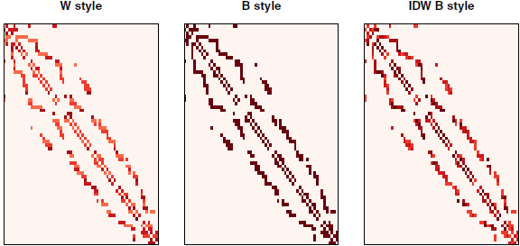
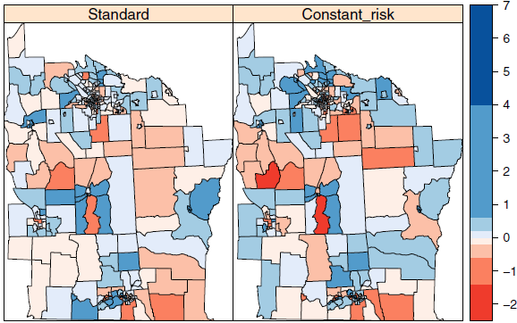
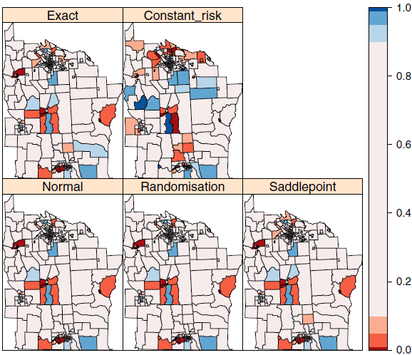
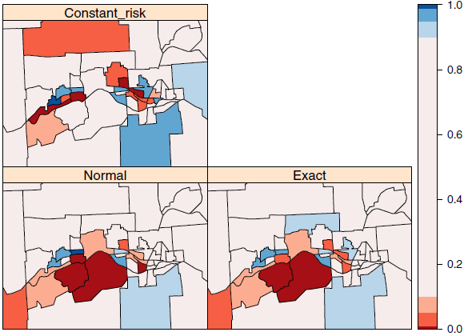

```{r setup, include=FALSE}
knitr::opts_chunk$set(
  echo = TRUE,
  cache = TRUE,
  message = FALSE,
  error = FALSE,
  warning = FALSE,
  tidy.opts=list(width.cutoff = 80),
  tidy = TRUE,
  prompt = TRUE
  )
options(kableExtra.latex.load_packages = FALSE)
require(kableExtra)
```

```{=tex}
\newpage
\pagenumbering{arabic}
\setcounter{page}{2}
\pagestyle{plain}
```
```{r, echo = FALSE}
ITabla <- function(M){
  kbl(M, booktabs = T) %>%
  kable_styling(latex_options = c("striped", "hold_position"))
}
```

# Introducción

A lo largo del desarrollo de este documento, se mostrará la construcción de vecinos y los pesos que se pueden aplicar a los vecindarios. Una vez que este importante y a menudo exigente prerrequisito esté en su lugar, se procede a buscar formas de medir la autocorrelación espacial.

Si bien las pruebas se basan en modelos de procesos espaciales, primero se examinan las pruebas y solo posteriormente se pasa al modelado. También es interesante mostrar cómo se puede introducir la autocorrelación espacial en datos independientes, de modo que se puedan realizar simulaciones.

El conjunto de datos con el que se trabajará en esta ocasión, contiene 281 distritos censales para ocho condados centrales del estado de Nueva York complementado con límites de tramo. El área tiene una extensión de unos 160 km de norte a sur y de 120 km de este a oeste.

```{r librerías}
library(rgdal)
library(sf)
library(spdep)
```

```{r}
NY8 <- readOGR("Base de datos", "NY8_utm18")
TCE <- readOGR("Base de datos", "TCE")
cities <- readOGR("Base de datos", "NY8cities")
```

```{r}
par(mfrow=c(1,2))
plot(NY8, border="grey60", axes=TRUE)
text(coordinates(cities), labels=as.character(cities$names), font=2, cex=0.9)
text(bbox(NY8)[1,1], bbox(NY8)[2,2], labels="a)", cex=0.8)
plot(NY8, border="grey60", axes=TRUE)
points(TCE, pch=1, cex=0.7)
points(TCE, pch=3, cex=0.7)
text(coordinates(TCE), labels=as.character(TCE$name), cex=0.7,
 font=1, pos=c(4,1,4,1,4,4,4,2,3,4,2), offset=0.3)
text(bbox(NY8)[1,1], bbox(NY8)[2,2], labels="b)", cex=0.8)
```

La figura $a)$ muestra las principales ciudades en el área de estudio y $b)$ la ubicación de 11 sitios de desechos peligrosos.

```{r}
spplot(NY8, c("PCTAGE65P"))
spplot(NY8, c("PCTAGE65P"), col="transparent")
```

```{r}
library("RColorBrewer")
#color palette creator function
rds <- colorRampPalette(brewer.pal(8, "RdBu"))
#get a range for the values
tr_at <- seq(min(NY8$PCTAGE65P), max(NY8$PCTAGE65P), length.out=20)
#create a color interpolating function taking the required
#number of shades as argument
tr_rds <- rds(20)
#parameters
# at - at which values colors change
# col.regions - specify fill colors 
tr_pl <- spplot(NY8, c("PCTAGE65P"), at=tr_at, col="transparent",
                col.regions=tr_rds, main=list(label="Age>65", cex=0.8))
plot(tr_pl)

```

# Vecinos espaciales y peso espacial

La creación de ponderaciones espaciales es un paso necesario en el uso de datos de área, quizás solo para verificar que no haya patrones espaciales restantes en los residuos. El primer paso es definir a qué relaciones entre observaciones se les dará un peso distinto de cero, es decir, elegir el criterio de vecino que se usará; el segundo es asignar pesos a los enlaces vecinos identificados.

Tratar de detectar patrones en mapas de residuos visualmente no es una opción aceptable, por lo que se incluyen un montón de funciones en el paquete **spdep** para ayudar.

Las viñetas **"nb","CO69"** y **"sids"** en **spdep** incluyen discusiones sobre la creación y el uso de ponderaciones espaciales, y se pueden acceder a ellas de la siguiente manera:

```{r}
vignette("nb",package = "spdep")
```

## Objetos vecinos

En el paquete spdep, las relaciones vecinas entre **n** observaciones están representadas por un objeto de clase **nb**. Es una lista de longitud n con los números de índice de vecinos de cada componente registrados como un vector entero. Si alguna observación no tiene vecinos, el componente contiene un número entero cero. También contiene atributos, típicamente un vector de identificadores de región de caracteres y un valor lógico que indica si las relaciones son simétricas. Los identificadores de región pueden usarse para verificar la integridad entre los datos mismos y el objeto vecino.

La función auxiliar **card** devuelve la cardinalidad del conjunto de vecinos para cada objeto, es decir, el número de vecinos.

```{r}
# reads a GAL lattice file into a neighbors list
NY_nb <- read.gal("Base de datos/NY_nb.gal", region.id = row.names(NY8))
summary(NY_nb)
```

```{r}
par(mfrow=c(1,1))
plot(NY8, border="grey60", axes=TRUE)
plot(NY_nb, coordinates(NY8), pch=19, cex=0.6, add=TRUE)
```

La figura muestra el gráfico vecino completo para el área de estudio de ocho condados.

Como ahora se tiene un objeto nb para examinar, se pueden presentar los métodos estándar para estos objetos. Hay métodos de impresión, resumen, diagrama y otros; el método de resumen presenta una tabla de la distribución del número de enlace, y tanto el método de impresión como el de resumen informan de la asimetría y la presencia de observaciones sin vecinos; la asimetría está presente cuando $i$ es un vecino de $j$ pero $j$ no es un vecino de $i$.

Con motivos de simplicidad al mostrar como crear objetos vecinos, se trabaja con un subconjunto del mapa que consta de los censos dentro de Syracuse, aunque los mismos principios se aplican al conjunto de datos completo.

```{r}
Syracuse <- NY8[NY8$AREANAME == "Syracuse city",]
Sy0_nb <- subset(NY_nb, NY8$AREANAME == "Syracuse city")
summary(Sy0_nb)
```

Se crean varios objetos vecinos de otras maneras para usarlos mas adelante.Tres son k objetos vecinos mas cercanos, tomando k puntos mas cercanos como vecinos (k=1,2 y 4 en este caso); esto se adapta a lo largo del área de estudio, teniendo en cuenta las diferencias en las densidades de área. Naturalmente, en la mayoría de los casos,esto conduce a vecinos asimétricos, pero asegurará que todas las áreas tengan **k** vecinos.

```{r}
coords <- coordinates(Syracuse)
IDs <- row.names(Syracuse)
Sy8_nb <- knn2nb(knearneigh(coords, k = 1), row.names = IDs)
Sy9_nb <- knn2nb(knearneigh(coords, k = 2), row.names = IDs)
Sy10_nb <- knn2nb(knearneigh(coords, k = 4), row.names = IDs)
dsts <- unlist(nbdists(Sy8_nb, coords))
Sy11_nb <- dnearneigh(coords, d1 = 0, d2 = 0.75 * max(dsts), 
                      row.names = IDs)
```

El objeto k= también es útil para encontrar la distancia mínima a la que todas las áreas tienen un vecino basado en la distancia. Usando la función $nbdist$, se puede calcular una lista de vectores de distancias correspondientes al objeto vecino. El mayor valor será la distancia mínima necesaria para asegurarse de que todas las áreas estén vinculadas al menos a un vecino, por lo que se puede crear fácilmente un objeto con observaciones sin vecino estableciendo el umbral superior por debajo de este valor.

## Objetos de ponderaciones espaciales

La ponderación espacial se puede ver como una lista de ponderaciones espaciales indexadas por una lista de vecinos entre \textit{i} y \textit{j} esel \textit{k-ésimo} elemento del \textit{i-ésimo} componente de la lista de ponderaciones, y \textit{k} nos dice cual de los \textit{i-ésimos} valores del componente de la lista de vecinos es igual a \textit{j}. Si \textit{j} no está presente en el \textit{i-ésimo} componente de la lista de vecinos, \textit{j} no es un vecino de \textit{i}. Por ello algunas de las ponderaciones \textit{$w_{ij}$} de la matriz de ponderaciones serán cero.

Una vez se establece la lista de los conjuntos de los vecinos en nuestra área de estudio, se procese a asignar los pesos espaciales, también es de tener en cuenta que se utiliza una notación bionaria cuando se sabe poco del proceso especial, dónde no hay una relación de vecino se pone 0 (cero) en caso contrario será la unidad.

La función `nb2listw` toma una lista de vecinos y lo convierte en un objeto de pesos. La conversión de los pesos se hace con un estilo $W$ que se hace bajo una estandarización por fila para sumar la unidad. El método de impresión \textit{(print)} para los objetos \text{listw} muestran las características de los vecinos subyacentes, el estilo de las ponderaciones espaciales y las constantes de las ponderaciones espaciales utilizadas en el cálculo de las pruebas de auto-correlación espacial. El componente de vecinos del objeto es el objeto nb subyacente, que proporciona la indexación del componente de ponderaciones.

```{r}
Sy0_lw_W <- nb2listw(Sy0_nb); Sy0_lw_W

names(Sy0_lw_W)

names(attributes(Sy0_lw_W))
```

Para el `style = "W"`, los pesos varían entre la unidad divida por el mayor y el menor número de vecinos, y las sumas de los pesos para cada entidad de área son la unidad. Este estilo se puede interpretar como el \textbf{valor medio entre vecinos}. Los pesos de los enlaces que se originan en áreas con pocos vecinos son mayores que los que se originan en áreas con muchos vecinos, quizá aumentando las entidades de área en el borde del área de estudio sin querer. Esta representación ya no es simétrica, pero es similar tiende a ser simétrica.

```{r}
1/rev(range(card(Sy0_lw_W$neighbours)))

summary(unlist(Sy0_lw_W$weights))

summary(sapply(Sy0_lw_W$weights, sum))
```

\textbf{Las funciones:}

-   `card` cuenta el número de vecinos en cada región en la lista de vecinos.

-   `range` toma el valor mínimo y el máximo.

-   `rev` revierte el vector

-   `unlist` saca la información o datos atómicos de una lista

-   `sapply` aplica la función suma a cada uno de los vectores asociado a las áreas.

La configuración de `style = "B"` - \textit{Binario} retiene un peso de unidad para cada relación de vecino, pero en este caso, las sumas de pesos de las áreas difieren según el número de áreas vecinas que tienen.

```{r}
Sy0_lw_B <- nb2listw(Sy0_nb, style = "B")
summary(unlist(Sy0_lw_B$weights))
summary(sapply(Sy0_lw_B$weights, sum))
```

El argumento `glist` se puede utilizar para pasar una lista de vectores de pesos generales correspondientes a las relaciones vecinas a `nb2list`. En este ejecicio se cree que la fuerza de las relaciones con los vecinos se atenúa con la distancia, por ello se estable en los pesos para que sean proporcionales ala distancia inversa entre los puntos que representan las áreas, usando `nbdists`para calcular las distancias para el objeto `nb` dado. Luego se usa `lapply` para invertir las distancias, obteniendo una estructura de pesos espaciales diferente a los anteriores. Si no se tiene ninguna razón para asumir más conocimiento sobre las relaciones con los vecinos que su existencia o ausencia, este paso es potencialmente engañoso. Si se sabe que el flujo de desplazamiento describen la estructura de las ponderaciones mejor que la alternativa binaria, puede valer la pena utilizarlas como ponderaciones generales; Sin embargo, puede haber problemas de simetría, porque tales flujos a diferencia de las distancias inversas, rara vez son simétricas.

```{r}
dsts <- nbdists(Sy0_nb, coordinates(Syracuse))
idw <- lapply(dsts, function(x) 1/(x/1000))
Sy0_lw_idwB <- nb2listw(Sy0_nb, glist = idw, style = "B")
summary(unlist(Sy0_lw_idwB$weights))
summary(sapply(Sy0_lw_idwB$weights, sum))
```

\textbf{La función:}

-   `nbdists` devuelve las distancias euclidianas dadas por un vector de enlaces de vecinos (un objeto nb).

-   `nb2listw` toma una lista de vecinos y lo convierte en un objeto de pesos.

-   `lapply` aplica a cada distancia euclidiana el inverso.

La siguiente figura muestra tres representaciones de ponderaciones espaciales para Syracuse mostradas como matrices. La imagen `style = "W"` de la izquierda es asimétrica, con colores más oscuros ue muestran pesos más gandes para áreas con pocos vecinos. Los otros dos paneles son simétricos, pero expresan diferentes suposiciones sobre las fortalezas de las relaciones con los vecinos.



La función `nb2listw` permite manejar listas de vecinos con áreas sin vecinos. Esto es debido porque la representación del conjunto vacío sea cero y debería ser representado como `NA` pero esto generaría problemas más adelante.

Es por esta razón que el argumento predeterminado es `cero.policy=FALSE`, lo que genera un error cuando se proporciona un argumento `nb` con áreas sin vecinos. Con el argumento `TRUE`permite la creación del objeto de ponderaciones espaciales, con ponderaciones cero.

```{r, error=TRUE}
Sy0_lw_D1 <- nb2listw(Sy11_nb, style = "B")
Sy0_lw_D1 <- nb2listw(Sy11_nb, style = "B", zero.policy = TRUE)
print(Sy0_lw_D1, zero.policy = TRUE)
```

Un problema paralelo de los conjuntos de datos con valores perdidos en las variables pero con ponderaciones espaciales especificadas se aborda mediante el método `subset.listw`, que vuelve a generar las ponderaciones para el subconjunto de áreas dado, por ejemplo, dado por `complete.cases`. Sabiendo qué observaciones están incompletas, los vecinos subyacentes y las ponderaciones se pueden subdividir en algunos casos, con el objetivo de evitar la propagación de los valores `NA` al calcular los valores con retraso espacial. Muchas pruebas y funciones de ajuste de modelos pueden llevar a cabo esto internamente si se establece el indicador de argumento apropiado, aunque el analista cuidadoso preferirá subconjuntos de los datos de entrada y los pesos antes de probar o modelar.

## Manejo de objetos de ponderaciones espaciales

Hay varios paquetes contribuidos que brindan soporte para matrices dispersas, entre las cuales `Matrix` es un paquete recomendado. La envoltura `as_dgRMatrix_listw` convierte un objeto `listw` en la matriz dispersa de formato orientado a filas comprimidas ordenadas por `Matrix`, como un objeto `dgRMatrix`, una subclase de la clase virtual `RsparseMatrix`. Es más fácil hacer una matriz dispersa orientada a filas a partir de un objeto de ponderaciones espaciales, ya que las ponderaciones están orientadas a filas. Una función que se usa mucho dentro de las funciones de prueba y ajuste de modelos es `listw2U`, que devuelve un objeto `listw` simétrico que representa la matriz de ponderaciones espaciales $\frac{1}{2}(W+W^T)$

Los objetos vecinos y de pesos pueden ser producidos en otros software e importarse a R y además se pueden exportar sin dificultad. Como ejemplo se han generado algunos archivos de [GeoDa](https://sgsup.asu.edu/geodacenter-redirect) a partir de distritos censales de Syracuse escritos como un shapefile, con el centroide utilizando aquí almacenado en el marco de datos. Los dos primeros son para vecinos de contigüidad. Estos archivos denomidos en formato GAL contienen solo información de vecinos y se describen en detalle en el archivo de ayuda que acompaña a la función `read.gal`

```{r}
Sy14_nb <- read.gal("Base de datos/Sy_GeoDa1.GAL")
isTRUE(all.equal(Sy0_nb, Sy14_nb, check.attributes = FALSE))
```

La función `write.nb.gal` se utiliza para escribir archivos en formato `GAL` a partir de `nb` objetos. GeoDa también crea archivos en formato `GWT`, descritos en la documentación de GeoDa y el archivo de ayuda, que también contienen información de distancia para el enlace entre las áreas, y se almacenan en una representación dispersa de tres columnas. Se pueden leer usando `read.gwt2nb`, aquí para un esquema de cuatro vecinos más cercanos, y solo usando los enlaces de vecinos.

```{r}
Sy16_nb <- read.gwt2nb("Base de datos/Sy_GeoDa4.GWT")
isTRUE(all.equal(Sy10_nb, Sy16_nb, check.attributes = FALSE))
```

Un conjunto similar de funciones está disponible para intercambiar pesos espaciales con la Biblioteca de Econometrics Espacial. La representación dispersa de pesos es similar al formato `GWT` y se puede importar usando `read.dat2listw.`

La exportación a tres formatos diferentes pasa por la función `listw2sn`, que convierte un objeto de pesos espaciales en una representación dispersa de tres columnas. El marco de datos de salida se puede escribir como un archivo en formato `GWT` con `write.sn2gwt` o como una representación de texto de una matriz dispersa para Matlab™ con `write.sn2dat`. Los archivos escritos con `write.sn2gwt` se pueden leer en Stata™ con `spmat import W using`. Existe una función llamada `listw2WB` para crear una lista de pesos espaciales para `WinBUGS`, que se escribirá en un archivo usando `dput`. Para objetos vecinos, se puede usar `nb2WB`, estableciendo todos los pesos a la unidad. De manera similar, un objeto vecino se puede exportar a un archivo con `nb2INLA`, para pasar datos al argumento del \textbf{gráfico} para el modelo `"bym"` en el ajuste usando `inla`. También es posible utilizar `nb2gra` en el paquete `BayesX` para convertir `nb` objetos al formato gráfico `gra`.

El `mat2listw` se puede utilizar para revertir el proceso, cuando una matriz de ponderaciones se ha leído en `R` y necesita convertirse en un vecino y un objeto de lista de ponderaciones. Desafortunadamente, esta función no establece el estilo del objeto `listw` a un valor conocido, utilizando `M` para señalar esta falta de conocimiento. Entonces es habitual reconstruir el objeto `listw`, tratando el componente de vecinos como un objeto `nb`, el componente de pesos como una lista de pesos generales y estableciendo el estilo en la función `nb2listw` directamente. Se utilizó para la importación inicial de las contigüidades de ocho condados, como se muestra en detalle en la página de ayuda `NY_data` proporcionada con `spdep`.

Finalmente, existe una función `nb2lines` para convertir listas de vecinos en objetos `SpatialLinesDataFrame`, dadas las coordenadas de los puntos que representan las áreas. Esto permite trazar objetos vecinos de una manera alternativa y, si es necesario, exportarlos como `shapefiles`.

## Uso de pesos para simular la autocorrelación espacial

En la siguiente figura se utilizó `listw2mat`para convertir un objeto de pesos espaciles en una matriz densa para su visualización. La misma función se utiliza para contruir una representación densada de l amatriz $(I-\rho \omega)$ para simular la autocorrelación espacial dentro de la función `invlrW`, donde $W$ es una matriz de ponderaciones, $\rho$ es un coeficiente de autocorrelación espacial e $I$ es la matriz de identidad. Este enfoque no impone condiciones estrictas para invertir las matrices a no ser de que sea una matriz singular, y sólo se aplica a simulaciones de un proceso autoregresivo simultáneo.


Para la simulación se utilizó un vector de número aleatorios iguales al número de secciones censales en Siracusa, usando las ponderaciones de contigüidad estandarizadas por filas para introducir la autocorrelación.

```{r}
set.seed(987654)
n <- length(Sy0_nb)
uncorr_x <- rnorm(n)
rho <- 0.5
autocorr_x <- invIrW(Sy0_lw_W, rho) %*% uncorr_x
```

El resultado que se muestra en la figura anterior, muestra el retardo espacial de la variable original no correlacionada versus con la variable aleatoria autocorrelacionada, donde ahora tiene una relación positiva entre los valores del tramo y el retardo espacial.

El método de retraso para objetos `listw` crea valores de "retraso espacial": $lag(y_i) = \sum_{j\in N_{i}} \omega_{ij}y_j$ para valores observados $y_i$; $N_i$ es el conjunto de vecinos de $i$. Si el estilo del objeto de ponderaciones es la estandarización de filas, los valores de $lag(y_i)$ serán promedios sobre los conjuntos de vecinos para cada $i$, más bien como una ventana móvil definida por $N_i$ e incluyendo valores ponderados por $\omega_{ij}$.

Para el análisis de datos de un área depende de manera crucial la construcción de los pesos espaciales, por ello se ha tomado el tiempo para describir las opciones que enfrenta el investigador. Ahora se procederá a modelar y probar la autocorrelación espacial utilizando supuestos sobre los procesos espaciales subyacentes.

# Prueba de autocorrelación espacial

Ahora que se tiene variedad de formas de construir pesos espaciales, se puede comenzar a usarlos para probar la presencia de autocorrelación espacial. Antes de comenzar, es muy útil revisar las suposiciones que se hacen en las pruebas; se usará la $I$ de Moran como ejemplo, pero las consecuencias también se aplican a otras pruebas.

Las pruebas suponen que el modelo medio de los datos elimina los patrones espaciales sistemáticos de los datos.Este error de especificación del modelo medio no es en absoluto infrecuente y puede ser inevitable cuando no se dispone de observaciones sobre las variables necesarias para especificarlo correctamente.

Otro problema que puede surgir es que los pesos espaciales que usamos para las pruebas no son los que generaron la autocorrelación. Esto es un reflejo de la especificación incorrecta del modelo de la varianza de los residuos del modelo medio, que también puede incluir hacer supuestos de distribución que no son apropiados para los datos, por ejemplo, asumiendo homocedasticidad o parámetros de forma regular (asimetría y curtosis). Algunos de estos pueden abordarse transformando los datos y utilizando la estimación ponderada, pero en cualquier caso, se necesita cuidado al interpretar la autocorrelación espacial aparente que en realidad puede provenir de una especificación incorrecta.

Dado que se sabe que la variable simulada anteriormente, se extrae al azar de la distribución normal, se puede manipular para ver qué sucede con los resultados de las pruebas en diferentes condiciones. La prueba $I$ de Moran , se calcula entonces como la razón del producto de la variable de interés y su rezago espacial, con el producto cruzado de la variable de interés y se ajusta a los pesos espaciales utilizados:

$$I = \cfrac{n}{\sum_{i=1}^{n} \sum_{j=1}^{n} \omega_{ij}} \cfrac{\sum_{i=1}^{n} \sum_{j=1}^{n} \omega_{ij} \left(y_i - \overline{y}\right)\left(y_j - \overline{y}\right)}{\sum_{i=1}^{n}\left(y_i-\overline{y}\right)^2},$$

donde $y_i$ es la i-ésima observación, $\overline{y}$ es la media de la variable de interés y $w_{ij}$ es el peso espacial del vínculo entre i y j.

Los resultados del test para cinco configuraciones, se recopilan a continuación; la primera columna contiene el valor observado de $I$, la segunda es el valor esperado (la cual es $-1/(n-1)$ para casos de media centrada), la tercera es la varianza del estadístico bajo aleatorización, a continuación la desviación estándar y finalmente, el valor-p de la prueba para la alternativa $I>E(I)$.

```{=tex}
\begin{table}[H]
\centering
\begin{tabular}{@{}lrrrrr@{}}
\toprule
 &
  \multicolumn{1}{l}{$I$} &
  \multicolumn{1}{l}{$E(I)$} &
  \multicolumn{1}{l}{$var(I)$} &
  \multicolumn{1}{l}{\textit{St. deviate}} &
  \multicolumn{1}{l}{$p-value$} \\ \midrule
uncorr\_x            & -0.03329 & -0.01613 & 0.00571 & -0.227 & 0.59    \\
autocorr\_x          & 0.2182   & -0.0161  & 0.0057  & 3.1    & 0.00096 \\
autocorr\_x k=1      & 0.1921   & -0.0161  & 0.0125  & 1.86   & 0.031   \\
trend\_x             & 0.23747  & -0.01613 & 0.00575 & 3.34   & 0.00041 \\
lm(trend\_x ~ et) & -0.0538  & -0.0309  & 0.0054  & -0.312 & 0.62    \\ \bottomrule
\end{tabular}
\end{table}
```
```{r}
moran.test(uncorr_x, listw=Sy0_lw_W)
moran.test(autocorr_x, listw=Sy0_lw_W)
moran.test(autocorr_x, listw=nb2listw(Sy9_nb, style="W"))
```

```{r}
et <- coords[,1] - min(coords[,1])
trend_x <- uncorr_x + 0.00025 * et
moran_t <- moran.test(trend_x, listw=Sy0_lw_W)
moran_t1 <- lm.morantest(lm(trend_x ~ et), listw=Sy0_lw_W)

```

Esto demuestra lo importante que puede ser entender que las pruebas de autocorrelación espacial también pueden reaccionar a un modelo mal especificado de la media, y que la omisión de una variable espacialmente modelada de la función media 'parecerá' como autocorrelación espacial a las pruebas.

## Pruebas globales

Quizá la prueba global mas común es `moran.test`y por esta razón se continuará usandola. Otras pruebas globales implementadas en el paquete `spdep` incluyen la $C$ de Geary (`geary.test()`), la $G$ global de GetisOrd (`gobalG.test()`) y la prueba de Mantel de producto cruzado general espacial, que incluye la $I$ de Moran, la $C$ de Geary y la variante Sokal de la C de Geary como formas alternativas (`sp.mantel.mc()`).

Todos estos test son para variables continuas, con `moran.test()` que tiene un argumento para usar un ajuste para una variable continua clasificada.

También hay pruebas de recuento de combinaciones para variables categóricas, con la variable de interés representada como un factor: `joincount.test()` para combinaciones del mismo color, `joincount.multi()` para combinaciones del mismo y de diferente color.

El resultado de los test es una desviación estándar que se compara con la districión Normal para encontrar el valor de probabilidad del estadístico observado bajo la hipótesis nula $H_0$ de no dependencia espacial para los pesos espaciales elegidos; la mayoria de veces la prueba es unilateral, con la hipótesis alternativa $H_1$ de que el estadístico observado es significativamente mayor que su valor esperado.

```{r}
moran.test(NY8$Cases, listw=nb2listw(NY_nb))
lw_B <- nb2listw(NY_nb, style="B")

moran.test(NY8$Cases, listw=lw_B)
moran.test(NY8$Cases, listw=lw_B, randomisation=FALSE)

lm.morantest(lm(Cases ~ 1, NY8), listw=lw_B)
lm.morantest.sad(lm(Cases ~ 1, NY8), listw=lw_B)
lm.morantest.exact(lm(Cases ~ 1, NY8), listw=lw_B)

# Monte Carlo test
set.seed(1234)
bperm <- moran.mc(NY8$Cases, listw=lw_B, nsim=999)
bperm

r <- sum(NY8$Cases)/sum(NY8$POP8)
rni <- r*NY8$POP8
CR <- function(var, mle) rpois(length(var), lambda=mle)
MoranI.pboot <- function(var, i, listw, n, S0, ...) {
  return(moran(x=var, listw=listw, n=n, S0=S0)$I)
}

set.seed(1234)

library(boot)

boot2 <- boot(NY8$Cases, statistic=MoranI.pboot, R=999, sim="parametric",
  ran.gen=CR, listw=lw_B, n=length(NY8$Cases), S0=Szero(lw_B), mle=rni)

pnorm((boot2$t0 - mean(boot2$t))/sd(boot2$t[,1]), lower.tail=FALSE)

```

## Pruebas locales

Las pruebas globales de autocorrelación espacial se calculan en base a las relaciones locales entre los valores observados y sus vecinos. Debido a esto se pueden dividir las pruebas globales en sus componentes y construir pruebas localizadas destinadas a detectar agrupamientos "Clusters" o "hotspots" observaciones con vecinos muy diferentes.

Para entrar en detalle se explicará a continuación un diagrama de dispersión de Moran de la variable de recuento de casos de leucemia; para un análisis de los diagramas de dispersión de Moran. En el gráfico se coloca en el eje x la variable de interés y en el $y$ la suma ponderada espacialmente de los vecinos. La I de Moran global es una relación lineal y ve representado como una pendiente; el gráfico se divide en cuatro cuadrantes que representan los valores medios de la variable y sus valores rezagados: bajo-bajo, bajo-alto, alto-bajo y alto-alto.

```{r}
moran.plot(NY8$Cases, listw = nb2listw(NY_nb, style = "C"))
```

Dado que el $I$ de Moran es global al igual que los coeficientes de correlación son similares (una relación lineal), también se pueden utilizar técnicas estándar para detectar observaciones con una influencia inusualmente fuerte en la pendiente. Específicamente, `moran.plot` llama a `influence.measures` en el modelo lineal de `lm(wx` $\sim$ `x)` proporcionando el coeficiente de pendiente, donde `wx` es el valor espacialmente rezagado de `x`. Esto significa que se puede ver si las relaciones locales particulares pueden influir en la pendiente más que proporcionalmente. En la siguiente figura se muestra áreas con influencia significativa (usando criterios estándar) codificadas por su cuadrante en el diagrama de dispersión de Moran.


Los valores de $I_i$ de Moran local se construyen como las $n$ componentes sumados para llegar a $I$ de Moran global:

$$I_i = \cfrac{(y_i - \overline{y})\sum_{j=1}^{n} \omega_{ij}(y_{j} - \overline{y})}{\cfrac{\sum_{i=1}^{n}(y_{i}-\overline{y})^2}{n}},$$

donde se sume que la media global $\overline{y}$ es una representación adecuada de la variable de interés $y$. Los dos componentes del numerador, $(y_i - \overline{y})$ y $\sum_{j=1}^{n} \omega_{ij}(y_{j} - \overline{y})$ aparecen sin centrarse en el diagrama de dispersión de Moran.

La estadística local puede probarse en busca de divergencia de los valores esperados, bajo supuestos de normalidad y aleatorización analítica, y utilizando aproximaciones de `Sasslepoint` y métodos exactos. Los dos últimos pueden ser importantes porque el número de vecinos de cada observación es muy pequeño y esto, a su vez, puede hacer que la adopción del supuesto de normalidad sea problemático. 

Es difícil detectar patrones locales residuales en presencia de autocorrelación espacial global. Por esta razón, los resultados para la dependencia local no deben verse como ``absolutos", sino que estan condicionados al menos por la autocorrelación espacial global, es decir por la posible influencia de los procesos de generación de datos espaciales en un rango de escalas desde el global hasta el local. Dependencia no detectada en la escala de las observaciones.

```{r}
lm1 <- localmoran(NY8$Cases, listw = nb2listw(NY_nb, style = "C"))

lm2 <- as.data.frame(localmoran.sad(lm(Cases ~ 1, NY8), nb = NY_nb, style = "C"))

lm3 <- as.data.frame(localmoran.exact(lm(Cases ~ 1, NY8), nb = NY_nb, style = "C"))

```

Waller y Gotway (2004, p. 239) extienden su tratamiento de hipótesis de riesgo constante al $I_i$ local de Moran, y podemos seguir su ejemplo:

```{r}
r <- sum(NY8$Cases)/sum(NY8$POP8)
rni <- r * NY8$POP8
lw <- nb2listw(NY_nb, style = "C")
sdCR <- (NY8$Cases - rni)/sqrt(rni)
wsdCR <- lag(lw, sdCR)
I_CR <- sdCR * wsdCR
```

La siguiente figura muestra los dos conjuntos de valores de $I_i$ de Moran local, calculados de la forma estándar y utilizando el supuesto de Poisson para la hipótesis de riesgo constante. Ya sabemos que el I global de Moran puede variar en valor e inferencia dependiendo de nuestras suposiciones, por ejemplo, que la inferencia debe tener en cuenta las desviaciones de nuestras suposiciones distributivas. Lo mismo se aplica aquí al supuesto para la distribución de Poisson de que su media y desviación estándar son iguales, mientras que la dispersión excesiva parece ser un problema en los datos que también muestran autocorrelación. Hay algunos cambios de signo entre los mapas, con los valores de la hipótesis de riesgo constante algo más alejados de cero.



También podemos construir una prueba de Monte Carlo simple de la hipótesis de riesgo constante de los valores locales de $I_i$ de Moran, simulando mucho como en el caso global, pero ahora conservando todos los resultados locales. Una vez que se completa la simulación, extraemos el rango del valor $I_i$ de Moran local de riesgo constante observado para cada tramo y calculamos su valor de probabilidad para el número de simulaciones realizadas. Usamos un enfoque paramétrico para simular los recuentos locales utilizando el recuento local esperado como parámetro de `rpois`, porque los recuentos de vecinos son muy bajos y hacen que la permutación sea imprudente. Llevar a cabo pruebas de permutación utilizando todo el conjunto de datos tampoco parece prudente, porque entonces estaríamos comparando iguales con diferentes (figura 5)

```{r}
set.seed(1234)
nsim <- 999
N <- length(rni)
sims <- matrix(0, ncol = nsim, nrow = N)

for (i in 1:nsim) {
  y <- rpois(N, lambda = rni)
  sdCRi <- (y - rni)/sqrt(rni)
  wsdCRi <- lag(lw, sdCRi)
  sims[, i] <- sdCRi * wsdCRi
}

xrank <- apply(cbind(I_CR, sims), 1, function(x) rank(x)[1])
diff <- nsim - xrank
diff <- ifelse(diff > 0, diff, 0)
pval <- punif((diff + 1)/(nsim + 1))
```

Finalmente, hacemos zoom para examinar los valores de probabilidad $I_i$ de Moran locales para tres métodos de cálculo para los tramos en y cerca de la ciudad de Binghampton (Fig. 6). Parece que el uso del enfoque de riesgo constante maneja la heterogeneidad en los conteos mejor que las alternativas. Estos resultados concuerdan en general con los alcanzados por Waller y Gotway (2004, p. 241), pero notamos que nuestro modelo subyacente es muy simplista. Encontrar la autocorrelación espacial no es un objetivo en sí mismo, ya sea local o global, sino más bien un paso en un proceso que conduce a un modelo adecuado. Es a esta tarea a la que nos dirigimos ahora.




# Ajuste de modelos de datos de área

## Enfoques de estadística espacial

### Modelos autorregresivos simultáneos

### Modelos autorregresivos condicionales

### Ajuste de modelos de regresión espacial
